# Comprehensive Implementation Plan: RPGHQ Userscript Manager

This document outlines the architecture, features, and implementation approach for creating a dedicated script manager with a dark theme and all the requested features.

## Core Architecture

```mermaid
graph TD
    A[RPGHQ Userscript Manager] --> B[Core]
    A --> C[UI]
    A --> D[API]
    
    B --> B1[ScriptRegistry]
    B --> B2[VersionManager]
    B --> B3[SettingsManager]
    B --> B4[InstallManager]
    
    C --> C1[MainPopup]
    C --> C2[ScriptListPanel]
    C --> C3[IndividualSettingsPanels]
    C --> C4[NotificationSystem]
    
    D --> D1[JSONFetcher]
    D --> D2[ScriptDownloader]
    
    B1 --> B1a[Tracks Installed Scripts]
    B1 --> B1b[Enables/Disables Scripts]
    
    B2 --> B2a[Version Comparison]
    B2 --> B2b[Update Check Scheduler]
    
    B3 --> B3a[GM Storage Interface]
    B3 --> B3b[Import/Export]
    
    B4 --> B4a[Individual Install]
    B4 --> B4b[Batch Install]
    B4 --> B4c[Dependency Resolution]
    
    C1 --> C1a[Tab Navigation]
    C1 --> C1b[Main Controls]
    
    C2 --> C2a[Available Scripts]
    C2 --> C2b[Installed Scripts]
    C2 --> C2c[Category Filters]
    
    C3 --> C3a[Setting Type Renderers]
    C3 --> C3b[Setting Storage]
    
    C4 --> C4a[Update Badges]
    C4 --> C4b[Toast Notifications]
    
    D1 --> D1a[Fetch from GitHub]
    D1 --> D1b[Parse JSON]
    
    D2 --> D2a[GM_xmlhttpRequest]
    D2 --> D2b[Script Installation]
```



## Data Structures

### Script Manifest JSON (hosted on GitHub)

```json
{
  "lastUpdated": "2025-03-20",
  "categories": [
    "UI Enhancement", 
    "User Management", 
    "Content Tools",
    "Notification", 
    "Utility"
  ],
  "scripts": [
    {
      "id": "ghost",
      "name": "Ghost",
      "description": "Hides content from ghosted users",
      "version": "5.8",
      "author": "You",
      "downloadURL": "https://github.com/loregamer/rpghq-userscripts/raw/ghosted-users/Ghost.user.js",
      "icon": "data:image/png;base64,...",
      "categories": ["User Management"],
      "dependencies": [],
      "settings": [
        {
          "id": "showGhostedPosts",
          "label": "Show Ghosted Posts",
          "type": "boolean",
          "default": false
        }
      ]
    },
    {
      "id": "avatar-replacer",
      "name": "Avatar Replacer",
      "description": "Replace avatars on the forum",
      "version": "1.2",
      "author": "You",
      "downloadURL": "https://github.com/loregamer/rpghq-userscripts/raw/main/Avatar-Replacer.user.js",
      "icon": "data:image/png;base64,...",
      "categories": ["UI Enhancement"],
      "dependencies": [],
      "settings": []
    }
    // More scripts...
  ]
}
```

### Local Storage Structure

```javascript
// InstalledScripts (GM_getValue/GM_setValue)
{
  "scripts": {
    "ghost": {
      "version": "5.8",
      "enabled": true,
      "installDate": "2025-03-20T12:34:56.789Z",
      "lastChecked": "2025-03-20T12:34:56.789Z"
    },
    "avatar-replacer": {
      "version": "1.2",
      "enabled": false,
      "installDate": "2025-03-20T12:34:56.789Z",
      "lastChecked": "2025-03-20T12:34:56.789Z"
    }
  },
  "lastUpdateCheck": "2025-03-20T12:34:56.789Z",
  "preferences": {
    "checkFrequency": "daily",
    "batchUpdateEnabled": true,
    "notifications": true
  }
}

// Script settings (individual GM values)
// Example for Ghost script
GM_setValue("script_settings_ghost", {
  "showGhostedPosts": false
});
```

## UI Design

### Main Popup

```
┌─ RPGHQ Userscript Manager ──────────────────────────────┐
│                                                         │
│  [Available (5)] [Installed (3)] [Categories] [Settings]│
│  ┌─────────────────────────────────────────────────────┐│
│  │                                                     ││
│  │  ● Ghost v5.8                            [Install]  ││
│  │    Hides content from ghosted users                 ││
│  │    Categories: User Management                      ││
│  │                                                     ││
│  │  ● Avatar Replacer v1.2                  [Install]  ││
│  │    Replace avatars on the forum                     ││
│  │    Categories: UI Enhancement                       ││
│  │                                                     ││
│  │  ● BBCode Helper v2.3                    [Install]  ││
│  │    Enhanced BBCode formatting                       ││
│  │    Categories: Content Tools                        ││
│  │                                                     ││
│  │                                                     ││
│  └─────────────────────────────────────────────────────┘│
│                                                         │
│  [Install All (5)] [Refresh List] [Close]               │
│                                                         │
└─────────────────────────────────────────────────────────┘
```

### Installed Scripts Tab

```
┌─ RPGHQ Userscript Manager ──────────────────────────────┐
│                                                         │
│  [Available (5)] [Installed (3)] [Categories] [Settings]│
│  ┌─────────────────────────────────────────────────────┐│
│  │                                                     ││
│  │  ● Ghost v5.8 [✓]                       [Settings]  ││
│  │    Hides content from ghosted users    [Uninstall]  ││
│  │    Status: Up to date                               ││
│  │                                                     ││
│  │  ● Avatar Replacer v1.2 [✓]             [Settings]  ││
│  │    Replace avatars on the forum        [Uninstall]  ││
│  │    Status: Update available (v1.3)     [Update]     ││
│  │                                                     ││
│  │  ● BBCode Helper v2.1 [ ]               [Settings]  ││
│  │    Enhanced BBCode formatting          [Uninstall]  ││
│  │    Status: Up to date                               ││
│  │                                                     ││
│  └─────────────────────────────────────────────────────┘│
│                                                         │
│  [Update All] [Export Settings] [Import Settings]       │
│                                                         │
└─────────────────────────────────────────────────────────┘
```

### Individual Settings Panel (example)

```
┌─ Script Settings: Ghost ──────────────────────────────┐
│                                                       │
│  Version: 5.8                                         │
│  Author: You                                          │
│                                                       │
│  ┌─ Settings ─────────────────────────────────────┐  │
│  │                                                │  │
│  │  [✓] Show Ghosted Posts                        │  │
│  │      Toggle visibility of ghosted content      │  │
│  │                                                │  │
│  │  [Ghost Users...] (Opens Ghost Users panel)    │  │
│  │                                                │  │
│  └────────────────────────────────────────────────┘  │
│                                                       │
│  [Save] [Reset to Defaults] [Back]                    │
│                                                       │
└───────────────────────────────────────────────────────┘
```

## Implementation Details

### 1. Core Components

#### Script Registry
- Manages the list of installed scripts
- Tracks script versions
- Maintains enable/disable state
- Persists data using GM_setValue/GM_getValue

#### Version Manager
- Compares installed vs. available versions
- Schedules automatic update checks
- Provides update notifications
- Handles version comparison logic

#### Settings Manager
- Creates a consistent API for script settings
- Handles importing/exporting settings
- Manages setting persistence

#### Install Manager
- Processes script installations (single and batch)
- Handles script updates
- Resolves dependencies
- Manages uninstallation

### 2. User Interface

#### Dropdown Menu Integration
- Adds a "Userscripts" dropdown in the same location as Ghost's "Ghosted Users"
- Opens the main userscript manager panel

#### Main Popup Panel
- Tab-based interface (Available, Installed, Categories, Settings)
- Script listings with install/update/uninstall options
- Batch operations (Install All, Update All)
- Responsive design that matches the forum's dark theme

#### Settings Panels
- Individual panels for each script's settings
- Type-specific input controls (toggles, text fields, selects, etc.)
- Save/cancel/reset functionality

#### Notification System
- Update badges on the userscripts menu
- Toast notifications for completed operations
- Visual indicators for available updates

### 3. API Layer

#### JSON Fetcher
- Retrieves script manifest from GitHub
- Caches data with appropriate expiration
- Handles network errors gracefully

#### Script Downloader
- Uses GM_xmlhttpRequest to download scripts
- Handles installation through Tampermonkey/Greasemonkey APIs
- Validates downloaded scripts before installation

## Implementation Steps

1. **Foundation Setup**:
   - Create basic userscript structure
   - Set up GM storage utilities
   - Implement JSON fetching from GitHub

2. **Core Logic**:
   - Build script registry functionality
   - Implement version checking system
   - Create installation manager

3. **UI Development**:
   - Design and implement the main popup
   - Create tab navigation system
   - Build script listing components
   - Develop individual settings panels

4. **Features Implementation**:
   - Enable/disable toggles for scripts
   - One-click update functionality
   - Import/export system
   - Categories and filtering
   - Notification system

5. **Testing & Refinement**:
   - Test all features
   - Optimize performance
   - Ensure responsive design

## Post-Launch Maintenance

- Setup for receiving user feedback
- Plan for regular updates to the script catalog
- Documentation for adding new scripts to the system
